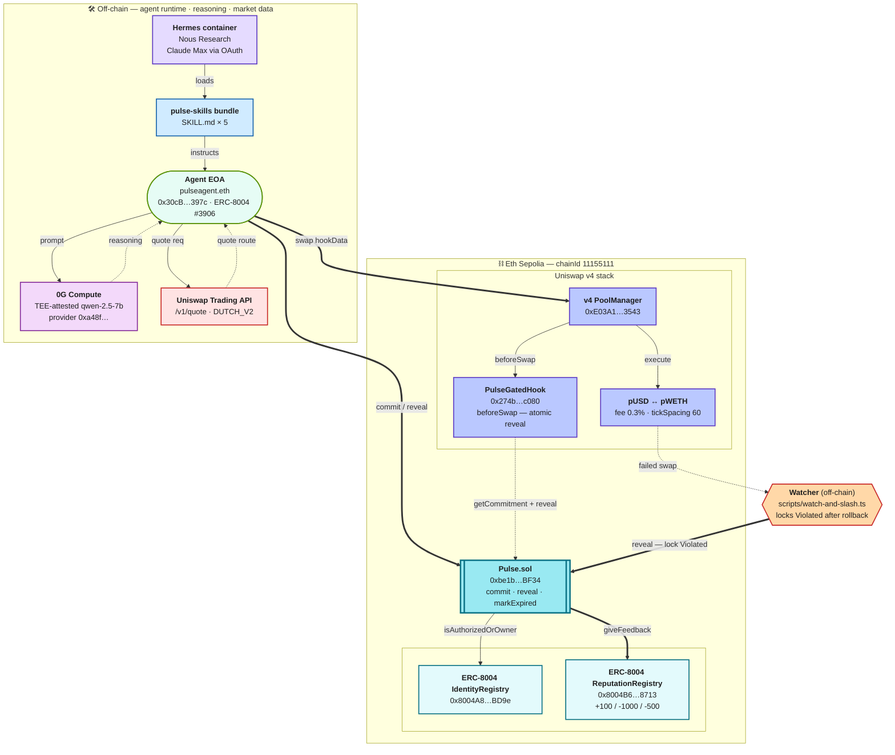

# Pulse Protocol

**Sealed Agent Commitments — extending the audit perimeter to the agent's reasoning.**

> Agents commit their decisions before they execute them — sealed reasoning,
> ERC-8004 reputation, and Uniswap v4 hook gating make drift slashable
> and (at the v4 layer) physically impossible.

[](https://sepolia.etherscan.io/address/0xbe1b0051f5672F3CAAc38849B8Aaeeb51Dc6BF34)
[](https://github.com/erc-8004/erc-8004-contracts)
[](https://docs.uniswap.org/contracts/v4/concepts/hooks)
[](https://docs.0g.ai/build-with-0g/compute-network/sdk)
[](#tests-17-passing)
[](#release-history)
[](https://hermes-agent.nousresearch.com/)
[](https://sepolia.app.ens.domains/pulseagent.eth)



> **Quick start.** `forge build && forge test` for the contracts;
> `bun run scripts/e2e-commit-reveal.ts` for the full commit / reveal /
> violated / expired flow on Eth Sepolia. Seven end-to-end scripts under
> [`scripts/`](scripts/) cover every load-bearing flow — see
> [Live demos on Eth Sepolia](#live-demos-on-eth-sepolia).
>
> **Architecture rationale + threat-model trade-offs.** See
> [`docs/adr/0001-audit-perimeter.md`](docs/adr/0001-audit-perimeter.md).

On April 18, 2026, KelpDAO and Aave lost $292 million. The smart contracts
were fine. No bug, no broken logic. The vulnerability was a single off-chain
configuration decision — outside the perimeter every audit had ever covered.

OpenZeppelin's postmortem named the gap: *code risk and operational risk are
not the same problem.* As protocols deepen integrations with off-chain
infrastructure, the operational surface grows faster than the auditable code
surface. ([Lessons From the KelpDAO Hack](https://www.openzeppelin.com/news/lessons-from-kelpdao-hack))

**Autonomous AI agents widen this gap.** The most consequential off-chain
component in any agent-driven protocol is the agent's *reasoning* — and audits
never see it. A model can be injected, drifted, or socially engineered, and
the contract executes the resulting action exactly as written.

## What Pulse does

Pulse extends the audit perimeter to the agent's reasoning. At decision time:

1. The agent calls a TEE and receives sealed reasoning + a cryptographic signature.
2. It commits the hash of `(action + reasoning)` onchain, identified by its ENS name (e.g. `pulseagent.eth`) and ERC-8004 token id.
3. Inside a fixed reveal window, the agent must reveal an action whose hash matches the commitment. Mismatch → automatic ERC-8004 reputation slash. No reveal → expiry slash.
4. On Uniswap v4, `PulseGatedHook` makes wrong-intent swaps physically impossible — they revert before any state change. Off-chain, the agent's swap path goes through the Uniswap Trading API.

The result: continuous reasoning provenance, not point-in-time signature.
Drift between intent and execution becomes detectable, slashable, and — at
the v4 layer — non-executable.

## Components

**`Pulse.sol`** — the commitment primitive. Time-locked commit-reveal of
`(action + sealed reasoning)`. Status transitions: `Pending → Revealed` (kept),
`Pending → Violated` (mismatched reveal), or `Pending → Expired` (no reveal).
ERC-8004 `ReputationRegistry.giveFeedback` fires on every transition.

**`PulseGatedHook.sol`** — Uniswap v4 hook with only `BEFORE_SWAP_FLAG` (no
NoOp surface). Swaps must include `hookData = abi.encode(commitmentId, nonce)`;
the hook either atomically reveals a `Pending` commitment or hash-verifies a
`Revealed` one. Wrong intent → revert before state change.

**ENS Agent Identity** — agents register an ENS name (e.g.
`pulseagent.eth`) whose text records resolve to their ERC-8004 entry,
TEE signer, and Pulse commitment history. One human-readable handle for the
agent's full provenance.

**Uniswap Trading API integration** — agents compute swap intents via the
Trading API (`trade-api.gateway.uniswap.org/v1/quote`), commit the resulting
`(PoolKey, SwapParams)` hash via Pulse, then execute through a v4 pool wired
with `PulseGatedHook` for protocol-level enforcement.

Reasoning is signed by a TEE provider via standard EIP-191 `personal_sign`.
Onchain verification uses OpenZeppelin's `SignatureChecker` (handles both EOA
and ERC-1271 signers). Reputation flows through the canonical ERC-8004
`ReputationRegistry`.

## Honest scope

- **Demo**: hardware-backed stand-in signer for reliability and reproducibility.
- **Production path**: 0G Compute sealed inference with enclave-born keys.
- The signer is fully pluggable (Phala, Marlin, Oasis, your own enclave).
- Pulse is voluntary signaling for agents that want to prove they're well-behaved. It does not stop bad actors from never opting in. As credit and yield primitives start reading ERC-8004 reputation, non-committing agents get priced out over time.

## Architecture

```
Agent reads context (markets, news, onchain state)
        │
        ▼
Sealed inference (TEE-attested) — agent reasons on context
        │
        ▼ provider TEE signs (EIP-191 personal_sign over
        │   keccak256(agentId || intentHash || reasoningCID || executeAfter))
        ▼
Pulse.commit(...) — onchain commitment locked
        │
        │  intentHash = keccak256(nonce || abi.encode(poolKey, swapParams))
        │
        ▼ (offchain: any scheduler queues a markExpired call at T+revealDeadline)
        ▼
[ T+executeAfter, T+revealDeadline ) — reveal window
        │
        ├─ Direct path: Pulse.reveal(id, nonce, actionData)
        │     ├─ keccak256(nonce || actionData) == intentHash → Status.Revealed
        │     │        + ReputationRegistry.giveFeedback(+100, "kept")
        │     └─ mismatch → Status.Violated + giveFeedback(-1000, "violated")
        │
        ├─ Hook-gated path: swapper submits to a v4 pool wired with PulseGatedHook
        │     hookData = abi.encode(commitmentId, nonce)
        │   PulseGatedHook.beforeSwap:
        │     ├─ commitment status Pending → atomically calls Pulse.reveal
        │     │       (kept → swap proceeds; mismatch → revert + state rolls back)
        │     └─ commitment status Revealed → verifies hash; allows swap
        │
        └─ no reveal by deadline → markExpired() callable by anyone
              → Status.Expired + giveFeedback(-500, "expired")
```

The hook makes Pulse load-bearing for swap *execution*, not just validation. A pool deployed with `PulseGatedHook` only accepts swaps backed by a Pulse commitment — agents cannot drift to a different action between the commit and the swap.

## Dependencies

- **OpenZeppelin Contracts v5.5+** — `SignatureChecker`, `MessageHashUtils`, `ReentrancyGuard` (consumed transitively through `OpenZeppelin/uniswap-hooks`)
- **OpenZeppelin/uniswap-hooks** — production-grade `BaseHook` for v4 hook implementations
- **Uniswap v4-core + v4-periphery** — `IPoolManager`, `Hooks`, `IHooks`, `BeforeSwapDelta`, `HookMiner` (transitively through `OpenZeppelin/uniswap-hooks`)
- **ERC-8004 IdentityRegistry + ReputationRegistry** — canonical deployments. Pulse does not redeploy them.
  - Eth Sepolia / Ethereum Sepolia IdentityRegistry: `0x8004A818BFB912233c491871b3d84c89A494BD9e`
  - Eth Sepolia / Ethereum Sepolia ReputationRegistry: `0x8004B663056A597Dffe9eCcC1965A193B7388713`
  - Reference implementation: [erc-8004/erc-8004-contracts](https://github.com/erc-8004/erc-8004-contracts)

## Quick start

```bash
forge install
forge build
forge test
```

Should report **17 tests passing** (6 Pulse + 11 hook).

Deploy Pulse to Eth Sepolia:

```bash
export PRIVATE_KEY=0x...
export SEPOLIA_RPC_URL=https://ethereum-sepolia-rpc.publicnode.com
forge script script/Deploy.s.sol --rpc-url sepolia --broadcast
```

Deploy `PulseGatedHook` against a v4 PoolManager:

```bash
export POOL_MANAGER=0x...        # v4 PoolManager on the target chain
export PULSE=0x...               # the Pulse address from the previous step
forge script script/DeployHook.s.sol --rpc-url sepolia --broadcast
```

The deploy script CREATE2-mines a salt that produces a hook address with the required `BEFORE_SWAP_FLAG` bits in its lower 14 bits. Override the registry defaults via `IDENTITY_REGISTRY` / `REPUTATION_REGISTRY` env vars for other chains.

## Repository layout

```
contracts/
├── Pulse.sol                       # commitment primitive
├── hooks/
│   └── PulseGatedHook.sol          # v4 hook gating swaps by Pulse commitments
├── interfaces/                     # subsets of canonical ERC-8004 ABIs
└── mocks/                          # used in tests only
script/
├── Deploy.s.sol                    # deploys Pulse against canonical registries
└── DeployHook.s.sol                # CREATE2-mines a salt + deploys the hook
test/
├── Pulse.t.sol                     # 6 tests on the commitment primitive
└── PulseGatedHook.t.sol            # 11 tests on the v4 hook layer
packages/
├── sdk/                            # @pulse/sdk — TypeScript client + intent/hookData helpers
├── agent/                          # reference agent that uses Pulse
└── plugins/
    └── pulse-skills/               # agent-agnostic skill bundle (any agent can install)
.claude/
└── skills/                         # third-party skills consumed in this repo (Uniswap, OZ, Pashov, ethskills, 0g-compute)
```

## Skills

### Consumed in this repo

This repo uses the `Uniswap/uniswap-ai` skills and the OpenZeppelin
`uniswap-hooks` library — the v4 hook here was built using their
`v4-hook-generator` decision table and audited against the
`v4-security-foundations` checklist before commit. See `CLAUDE.md` for the
full skill index and which skill applies to which task.

### Published by this repo: `pulse-skills`

Pulse ships its own agent-agnostic skill bundle so **any** agent runtime
(OpenClaw, Hermes, ElizaOS / Eliza, LangChain, bare Anthropic-API, web3.py)
can plug into Pulse without re-deriving the agent-side know-how.

```bash
# install via skills.sh
npx skills add ss251/ethglobal-openagents

# or via Claude Code marketplace
/plugin install pulse-skills@ss251/ethglobal-openagents
```

| Skill                          | When to use                                                                                              |
| ------------------------------ | -------------------------------------------------------------------------------------------------------- |
| `pulse-autonomous-trade`       | **Keystone.** End-to-end reason → commit → wait → atomic-reveal swap from a natural-language objective.  |
| `pulse-commit`                 | Bind agent to a hashed action + sealed reasoning at time T.                                              |
| `pulse-reveal`                 | Close a commitment with matching nonce + actionData inside the window.                                   |
| `pulse-status-check`           | Read commitment state cheaply before reveal/swap/expire.                                                 |
| `pulse-gated-swap`             | Execute a Uniswap v4 swap *through* a Pulse commitment — wrong intent doesn't just slash, it reverts.    |
| `pulse-recover`                | Re-submit a gated swap when a previous run committed but the swap reverted. Same intent, same nonce.     |
| `pulse-introspect`             | Inspect recent agent-wallet activity or a single commitment without writing a block-scanner.             |
| `sealed-inference-with-pulse`  | Pull TEE-signed reasoning (0G Compute or any EIP-191 signer) and bind it to commit.                      |

Framework adapter recipes for OpenClaw, Hermes, ElizaOS, LangChain,
Anthropic SDK, and Python live in
[`packages/plugins/pulse-skills/integrations/`](packages/plugins/pulse-skills/integrations/).

### How to plug your agent into Pulse

Pulse is *script-driven*: every skill is a thin wrapper over a TS runner under
[`scripts/`](scripts/) that takes CLI args and emits a single JSON object on
stdout. Your agent only needs a `terminal` (or equivalent shell-exec) tool —
no SDK import, no contract bindings, no chain-aware glue.

The script surface is the public contract:

| Script                                    | Skill                       | Purpose                                                |
| ----------------------------------------- | --------------------------- | ------------------------------------------------------ |
| `scripts/autonomous-trade.ts`             | `pulse-autonomous-trade`    | Reason → commit → wait → atomic-reveal swap            |
| `scripts/force-drift.ts`                  | (demo)                      | Demonstrate hook + slash protection                    |
| `scripts/pulse-status.ts <id>`            | `pulse-status-check`        | One-shot status read with window flags                 |
| `scripts/pulse-introspect.ts`             | `pulse-introspect`          | Recent agent txs OR `--commitment-id N` deep dive      |
| `scripts/pulse-retry.ts`                  | `pulse-recover`             | Recover Pending commitment after a swap revert         |

All scripts share `scripts/_lib/` (env loader, ABIs, direction-aware funding,
Pulse helpers, BigInt-safe JSON output) so behavior is consistent across them.

**Three guarantees the integrator can rely on:**

1. **`.env` beats shell env.** The shared loader explicitly overwrites
   `process.env` from the `.env` file. No more agent-runs surprised by a
   stale `AGENT_ID` exported by an unrelated bot's shell.
2. **Failures are recoverable.** When `autonomous-trade.ts` commits but the
   swap reverts, the JSON output includes a `recovery` block with the exact
   `pulse-retry.ts` invocation needed to settle the Pending commitment
   inside its reveal window. The agent does not have to introspect chain
   state or roll its own retry script.
3. **BigInt-safe JSON.** Every stdout payload uses a serializer that turns
   uint256s into strings, so an agent that pipes the output through
   `JSON.parse` never crashes on a serialization edge case.

A minimal integrator flow looks like:

```bash
# 1. happy path
bun run scripts/autonomous-trade.ts --direction sell --base-amount 0.005 --min-price 1500

# 2. if step 1 returned status=SwapReverted, the JSON has a recovery.pulseRetryCmd
#    for the agent to invoke verbatim (no manual hash juggling)
bun run scripts/pulse-retry.ts --commitment-id 11 --nonce 0xa8a3… --action-data 0x…

# 3. diagnose anytime
bun run scripts/pulse-introspect.ts --commitment-id 11
```

The agent's policy lives in [`hermes-sandbox/SOUL.md`](hermes-sandbox/SOUL.md)
(persona) and the skill files under
[`packages/plugins/pulse-skills/skills/`](packages/plugins/pulse-skills/skills/)
(when-to-use guidance per-skill). Both are `npx skills add`-portable.

## Threat model — what Pulse defends against and what it doesn't

Pulse is a signaling and enforcement primitive for *committing* agents. It
does not pretend to be a fortress against *non-committing* adversaries. The
honest table:

| Attack | Defended? | Notes |
| --- | --- | --- |
| Agent reasoning drifts between commit and execution (injection, social engineering, rationalization) | **Yes** for v4 swaps via `PulseGatedHook` (revert before state change). **Yes** for non-swap actions via direct `Pulse.reveal` mismatch detection + ERC-8004 slash. | The core thing Pulse is designed for. |
| Atomic-reveal rollback gap: hook reverts on mismatch, the would-be `Violated` state rolls back too | **Mitigated** via `scripts/watch-and-slash.ts`, a watcher service that calls `Pulse.reveal` directly with the mismatched data outside the hook flow. Locks in the slash. | See SPEC §"Atomic-reveal rollback note." |
| Front-run on reveal broadcast | **Mitigated for swaps** (atomic reveal inside `beforeSwap`). Open for non-swap actions — use private mempool (Flashbots Protect) for those. | |
| Malicious operator never opts in | **Not defended.** Pulse is voluntary. The defense is downstream: as credit, yield, and task layers price ERC-8004 reputation, non-committing agents get worse terms over time. | |
| Reputation farming via trivial commitments | **Not defended in v0.3.** Future work: stake-weighted reputation. | |
| Vague reasoning that covers any future action | **Partial.** Pulse certifies hash equality, not semantic specificity. Recommend a minimum-substance reasoning policy enforced off-chain by reviewers. | |
| Selective reveal / optionality (commit to multiple actions, reveal the favorable one) | **Not defended in v0.3.** Each unrevealed commitment costs `-500` rep on expiry. Profitable only if reputation isn't economically priced. | |
| Sybil / burner agents | **Inherits ERC-8004 weakness.** No proof-of-personhood. | |
| `signerProvider` is an EOA pretending to be a TEE | **Honestly disclosed.** The contract checks ECDSA recovery, not attestation. README, SPEC, and demo UI all explicitly label "stand-in vs production 0G enclave-born key." | |
| Wash-trade reputation between same-owner agents | **Inherited ERC-8004 weakness.** | |
| Honest-on-paper, malicious-in-practice business model | **Not defended.** Pulse certifies *consistency*, not *quality of intent.* | |
| `eth_estimateGas` underbudgets close-tx (reveal/markExpired) gas | **SDK-mitigated.** `Pulse.reveal` and `markExpired` invoke `ReputationRegistry.giveFeedback` through a `try/catch`. RPCs estimate the OOG-success branch (catch swallows the inner OOG) and quote ~225k, but the inner storage writes need ~450k. The SDK ships explicit defaults (`DEFAULT_REVEAL_GAS = 600_000`, `DEFAULT_MARK_EXPIRED_GAS = 500_000`); custom integrators must override. | Discovered during e2e on Eth Sepolia. |

The `watch-and-slash.ts` watcher is the single most important post-deployment
operational addition — it closes the atomic-reveal rollback gap without
contract changes.

## Status

### Deployed on Eth Sepolia (chainId 11155111)

| Contract | Address | Explorer |
| --- | --- | --- |
| **Pulse** | `0xbe1b0051f5672F3CAAc38849B8Aaeeb51Dc6BF34` | [Etherscan](https://sepolia.etherscan.io/address/0xbe1b0051f5672F3CAAc38849B8Aaeeb51Dc6BF34) |
| **PulseGatedHook** | `0x274b3c0f55c2db8c392418649c1eb3aad1ecc080` | [Etherscan](https://sepolia.etherscan.io/address/0x274b3c0f55c2db8c392418649c1eb3aad1ecc080) |
| **Pulse Mock USD (`pUSD`)** | `0xB1e9c59B50D3b79cA09f4f9fd6ca5cC027EAeDDA` | [Etherscan](https://sepolia.etherscan.io/address/0xB1e9c59B50D3b79cA09f4f9fd6ca5cC027EAeDDA) |
| **Pulse Mock WETH (`pWETH`)** | `0xC8d229E60C4a02fA49D060B1f0b08D956E6ef349` | [Etherscan](https://sepolia.etherscan.io/address/0xC8d229E60C4a02fA49D060B1f0b08D956E6ef349) |

Pool: `pUSD ↔ pWETH`, fee `0.3%`, tickSpacing 60, initialized at 1:1 with a
wide-range LP position via `script/Phase2.s.sol`.

Hook permission flags = `0x0080` = `BEFORE_SWAP_FLAG` only (no NoOp surface,
no `beforeSwapReturnDelta`). Mined via CREATE2 salt 57991.

Wires into:
- ERC-8004 IdentityRegistry `0x8004A818BFB912233c491871b3d84c89A494BD9e`
- ERC-8004 ReputationRegistry `0x8004B663056A597Dffe9eCcC1965A193B7388713`
- Uniswap v4 PoolManager `0xE03A1074c86CFeDd5C142C4F04F1a1536e203543`
- 0G Compute provider `0xa48f01287233509FD694a22Bf840225062E67836` (qwen-2.5-7b-instruct, TEE-attested proxy)

**Agent identity (ENS).** [`pulseagent.eth`](https://sepolia.app.ens.domains/pulseagent.eth)
on Sepolia ENS is the human-readable handle for the agent. Five text records
(`agentId`, `signerProvider`, `pulseHistory`, `description`, `avatar`) are
bound via the Public Resolver, so downstream tooling can take just the name
and resolve `(addr, agentId, TEE signer)` without ever reading the `.env`.
The `pulseProvenanceFromENS()` helper in `@pulse/sdk` does exactly that, and
`scripts/ens-bind-demo.ts` exercises it end-to-end (writes records, resolves
back, commits via Pulse using only ENS-resolved data).

Full deployment record (constructor args, gas, dependencies) at
[`deployments/sepolia.json`](deployments/sepolia.json).

### Live demos on Eth Sepolia

Seven end-to-end scripts exercise the deployed contracts; each prints tx
hashes you can open in Etherscan.

| Script | What it proves |
| --- | --- |
| `bun run scripts/e2e-commit-reveal.ts` | All three commitment outcomes (`Revealed`, `Violated`, `Expired`) flip ERC-8004 reputation on chain via the deployed `ReputationRegistry`. |
| `bun run scripts/exercise-gated-swap.ts` | The `PulseGatedHook` rejects naked swaps and admits Pulse-bound swaps that atomically reveal the commitment. |
| `bun run scripts/violation-and-rollback-demo.ts` | The atomic-reveal rollback gap is real (status returns to Pending after the cheating-swap revert), and the off-chain watcher closes it by calling `Pulse.reveal` directly to lock in `Violated`. |
| `bun run scripts/sealed-inference-demo.ts` | A 0G-attested qwen reasoning blob is hashed into `reasoningCID` and anchored on chain in a real Pulse commitment. |
| `bun run scripts/phase8-tradingapi-demo.ts` | A live Uniswap Trading API quote (mainnet UniswapX DUTCH_V2, real liquidity) is normalized into `intentHash`+`reasoningCID` and committed on Eth Sepolia. The commitment carries the quote's `requestId` so anyone can re-pull and verify. |
| `bun run scripts/ens-bind-demo.ts` | Binds 5 text records on `pulseagent.eth`, resolves them back via `pulseProvenanceFromENS()`, then submits a `Pulse.commit` whose `agentId` and `signerProvider` come *only* from ENS — proves ENS does real work in the agent identity stack. |
| `bun run scripts/watch-and-slash.ts` | Long-running watcher service that does the rollback recovery automatically. |

### Tests: 17 passing

- Pulse: commit, reveal-match, reveal-mismatch, reveal-too-early, expire,
  wrong-signer, non-owner reverts
- PulseGatedHook: atomic-reveal swap, separate-reveal swap, missing
  commitment, mismatched intent, pre-window, post-deadline, malformed
  hookData, expired status, separate-mismatch-locks-Violated, double-spend
  edge case

### Hermes integration — autonomous Pulse-bound trading agent in Telegram

`pulseagent.eth` runs as an autonomous trading agent inside a sandboxed
[NousResearch/hermes-agent](https://github.com/NousResearch/hermes-agent)
container. You **chat with it in Telegram**. The agent has a persona
(`hermes-sandbox/SOUL.md`), a wallet (the agent EOA, ERC-8004 #3906),
six pulse-skills loaded by name via SkillUse, and the full Hermes tool
catalog enabled (memory, cronjob, todo, clarify, terminal, file,
skills). The container's entrypoint is `hermes gateway run` — the
gateway polls Telegram, persists sessions per `chat_id` in SQLite,
auto-routes voice memos through Whisper, and invokes pulse-skills
exactly like Hermes' own bundled skills.

#### Demo prompts (sent to `@<your-bot>` in Telegram)

| Prompt | What the agent does |
| --- | --- |
| `What's the status of commitment 8?` | Loads `pulse-status-check`, calls `bun run scripts/pulse-status.ts 8`, reports status + window + recommended watcher action with clickable Etherscan links. |
| `Sell 0.01 pETH for at least 1800 pUSD.` | Loads `pulse-autonomous-trade`, runs the keystone executor: 0G TEE-attested reasoning → `intentHash` → `Pulse.commit` → wait `executeAfter` (~30s) → atomic-reveal swap through `PulseGatedHook` → reports cid + commit tx + swap tx. Status flips to `Revealed`, +100 ERC-8004 reputation. |
| `Now drift the agent — execute a different swap than what was committed.` | Loads `pulse-autonomous-trade` and runs `scripts/force-drift.ts`. The hook reverts the drifted swap before any state change; the watcher closes the rollback gap with a direct `Pulse.reveal(drifted_data)`; commitment goes `Violated`, **−1000 ERC-8004 reputation**. The killshot demo. |
| `Resolve pulseagent.eth and show me the bound text records.` | Loads `pulse-status-check` (or just terminal), runs ENS resolution against the Public Resolver, surfaces all five text records (agentId, signerProvider, pulseHistory, description, avatar). |
| `Schedule a portfolio status check every 5 minutes.` | Uses the `cronjob` tool to schedule recurring `pulse-status-check` runs. Results land in your Telegram DM via the gateway's home-channel route. |

#### Setup (one-time)

```bash
./hermes-sandbox/up.sh        # build container + install bun + sync skills
./hermes-sandbox/auth.sh      # Claude Code OAuth + install pulseagent SOUL.md persona

# Bind a non-OAuth API key (lifts the Pro/Max body-size gate; required
# for the skills toolset and full SkillUse — see AUTH_NOTES.md Finding 3)
docker exec --user hermes hermes /opt/hermes/.venv/bin/hermes \
  auth add anthropic --type api-key --api-key sk-ant-api03-...

# Configure the Telegram bot (gateway auto-reads /opt/data/.env on startup)
docker exec --user hermes bash -c '
  echo TELEGRAM_BOT_TOKEN=<from-BotFather>          >> /opt/data/.env
  echo TELEGRAM_ALLOWED_USERS=<your-numeric-id>    >> /opt/data/.env
'
docker restart hermes
```

That's it. Open Telegram → `@<your-bot>` → start chatting.

#### Architecture (what runs where)

```
                        ┌────────────────────────────────────┐
                        │  Telegram                          │
                        │     ↑↓                             │
   You → @yourbot ──→   │  hermes gateway (entrypoint)       │
                        │     ├─ persistent sessions (SQLite)│
                        │     ├─ allowlist (your user_id)    │
                        │     ├─ voice memos → STT (Whisper) │
                        │     └─ message routing             │
                        │            ↓                       │
                        │  Hermes agent (Claude haiku-4-5)   │
                        │     ├─ SOUL.md persona             │
                        │     ├─ memory + cronjob + todo     │
                        │     ├─ skills toolset (SkillUse)   │
                        │     │      ↓                       │
                        │     │   pulse-autonomous-trade ──→ │ terminal
                        │     │   pulse-status-check         │ tool
                        │     │   pulse-commit / -reveal     │   ↓
                        │     │   pulse-gated-swap           │ bun run
                        │     │   sealed-inference-with-pulse│   ↓
                        │     │                              │ scripts/
                        │     └─ Anthropic API key path      │ autonomous-
                        └────────────────────────────────────┘ trade.ts
                                       │
                       ┌───────────────┴────────────────┐
                       ↓                                ↓
                0G Compute (TEE)              Eth Sepolia (Pulse, hook,
                qwen-2.5-7b                   ERC-8004, ENS, v4 pool)
```

The keystone is `pulse-autonomous-trade` — its [SKILL.md](packages/plugins/pulse-skills/skills/pulse-autonomous-trade/SKILL.md)
tells the LLM to call `bun run scripts/autonomous-trade.ts` with parsed
args; the script does ALL the on-chain work (signing, hashing, RPC
calls, gas tuning) and emits a single JSON object the LLM formats into
a Telegram-ready reply.

#### Why the polling shim is gone

A previous version (v0.1.5) used a custom `scripts/telegram-pulse-bot.ts`
that wrapped `docker exec hermes hermes -z "..."` for every message. It
was deleted in v0.2.0 because:

- It threw away conversation context every turn (`-z` is a one-shot CLI mode)
- It couldn't access memory, cron, todo, or any other long-running tools
- It re-implemented things Hermes already shipped (long polling, allowlist, sessions, voice transcription, group support, model picker)
- It made the agent feel like a tool dispatcher with three canned prompts, not an agent in the wild

The Hermes gateway is the canonical shape. We followed the docs.

## Release history

### v0.3.0 — Integrator pass: drop-in agent recovery + script library *(2026-04-29)*

Born out of the un-coached Telegram test. With no skill name in the prompt,
the agent autonomously loaded `pulse-autonomous-trade` and committed to
Pulse — proving SOUL.md is load-bearing. But the swap reverted (~30k gas)
because `ensureFundedAndApproved` only checked TOKEN0 balance and skipped
minting TOKEN1 (the token being sold). The agent then spent twelve minutes
writing inline viem block-scanners and a one-shot retry script before
recovering. v0.3.0 turns that whole detour into a single helper invocation.

- **`scripts/_lib/`** — shared library so every script behaves the same.
  - `env.ts` — explicit `.env` loader that *overrides* shell env. Closes
    the AGENT_ID=5263-from-OpenClaw-bot leak that signed commits for the
    wrong agent in the un-coached run.
  - `funding.ts` — direction-aware funding. Only checks + mints + approves
    the token actually being sold. Replaces the buggy ensureFundedAndApproved
    that copy-paste lived in two scripts.
  - `abi.ts`, `pulse.ts`, `output.ts` — single source of truth for ABIs,
    contract reads, BigInt-safe JSON output.
- **`scripts/pulse-retry.ts` + `pulse-recover` skill** — first-class
  recovery primitive. Reads on-chain commitment state, validates the
  reveal window, ensures funding (direction-aware), re-submits the gated
  swap with the original nonce. Returns structured `Skipped` results
  with reason codes when the commitment is in a terminal state or past
  its window — so the agent can branch instead of paying gas on a doomed
  retry.
- **`scripts/pulse-introspect.ts` + `pulse-introspect` skill** — replaces
  the agent's tendency to write inline `eth_getBlock` loops. Two modes:
  recent-activity scan (`--last N` or `--from-block N`) and single-commitment
  inspect (`--commitment-id N`). Decodes function selectors against
  Pulse + ERC-20 + SwapTest ABIs. BigInt-safe.
- **`autonomous-trade.ts` JSON contract** — when the swap reverts, the
  output now includes a `recovery` block with the exact `pulseRetryCmd`
  the agent should invoke verbatim. No nonce-grepping, no manual hash
  reconstruction.
- **SOUL.md** — added a "When something goes wrong" section pointing at
  `pulse-introspect` first, then `pulse-recover` if the commitment is
  recoverable, then `markExpired` if not. Hard rule: never write inline
  block-scanners or one-shot retry scripts.
- **README** — new "How to plug your agent into Pulse" section that
  documents the script surface as the public contract, with three
  guarantees (.env wins, failures are recoverable, BigInt-safe JSON) and
  a 3-step minimal integrator flow.

Verified live on Sepolia after the fix: commitment #12 succeeded end-to-end
from a plain "sell 0.005 pETH for at least 1500 pUSD" prompt with no skill
name. `getStatus(12) = Revealed`.

### v0.2.0 — Autonomous trading agent in Telegram *(2026-04-29)*

Pivot from "tool dispatcher in a CLI shim" to a real autonomous agent in
the wild. The standalone `scripts/telegram-pulse-bot.ts` polling shim is
deleted; everything is on Hermes' canonical infrastructure now.

- **Hermes gateway** (`hermes gateway run` is the container's entrypoint)
  replaces the polling shim entirely. Native Telegram support: persistent
  sessions per `chat_id` in SQLite, voice memos transcribed via Whisper,
  group chats, slash commands, `/model` picker, `/new`/`/reset`.
- **Persona** — `hermes-sandbox/SOUL.md` defines the autonomous trading
  agent identity (pulseagent.eth, ERC-8004 #3906, the wallet, hard
  rules: never execute without committing first). Reloaded per turn,
  shapes every response. `auth.sh` installs it into the container at
  `/opt/data/SOUL.md`.
- **Full tool catalog re-enabled** — `memory`, `cronjob`, `todo`,
  `clarify`, `skills` all on. The body-size gate that forced us to trim
  on Pro/Max OAuth no longer applies once an Anthropic API key is bound
  alongside (Finding 3 in AUTH_NOTES.md).
- **`pulse-autonomous-trade` keystone skill** —
  [`packages/plugins/pulse-skills/skills/pulse-autonomous-trade/SKILL.md`](packages/plugins/pulse-skills/skills/pulse-autonomous-trade/SKILL.md).
  The agent loads it whenever the user gives a trading objective in
  natural language. The skill instructs the LLM to call
  [`scripts/autonomous-trade.ts`](scripts/autonomous-trade.ts) which runs
  the full reason → commit → wait → atomic-reveal swap cycle on Eth
  Sepolia and emits structured JSON for Hermes to format.
- **Force-drift demo** —
  [`scripts/force-drift.ts`](scripts/force-drift.ts) commits an honest
  intent A, attempts to execute a drifted intent B; the v4 hook reverts
  before any state change; the watcher closes the rollback gap with a
  direct `Pulse.reveal(B)`; commitment goes Violated, agent slashed
  −1000 ERC-8004 reputation. The killshot demo.
- **ERC-7857 (0G iNFT) integration scoped** — issue
  [#1](https://github.com/ss251/ethglobal-openagents/issues/1) captures
  the integration sketch for the 0G Open Agents Track 2 prize ($7,500).

### v0.1.5 — Pre-publish doc sweep *(2026-04-29)*

Bug fix in `scripts/gen-keys.ts` that wrote `https://sepolia.base.org`
into freshly generated `.env` files; corrected to the publicnode Eth
Sepolia RPC. Stale `forge.pulseagent.eth` references throughout the
codebase replaced with the actually-registered `pulseagent.eth`.
Outward-facing "Pulse Protocol" labels in CLI banners and the diagram
title shortened to "Pulse" (README header retains the formal name).

### v0.1.4 — Hermes invokes pulse-skills by name *(2026-04-29)*

Bound a non-OAuth Anthropic API key alongside the existing OAuth
credential; re-enabled the `skills` toolset that was previously closed
off by the Claude Pro/Max body-size gate. With API key in the credential
pool, the gate is gone and `hermes` can invoke pulse-skills by name via
the SkillUse tool. Validated end-to-end with `pulse-status-check` on
commitment #8: haiku-4-5 surfaced the full provenance trail in one turn.

### v0.1.3 — Hermes-driven Pulse status check + AUTH_NOTES Finding 3 *(2026-04-29)*

Added [`scripts/pulse-status.ts`](scripts/pulse-status.ts) — standalone
helper mirroring the `pulse-status-check` skill recipe (used by agents
and watchers). Documented Finding 3 in
[`hermes-sandbox/AUTH_NOTES.md`](hermes-sandbox/AUTH_NOTES.md): enabling
the `skills` toolset under Pro/Max OAuth pushes request body past the
~23 KB threshold and the call hangs silently. Workaround documented as
the API-key escape route used in v0.1.4.

### v0.1.2 — ENS Track 1 deliverable *(2026-04-29)*

- **`pulseagent.eth` registered** on Sepolia ENS, owned by the agent EOA
  ([`0x30cB…397c`](https://sepolia.etherscan.io/address/0x30cB0080bFE9bB98d900726Fd3012175ee3D397c)).
  Five text records (`agentId`, `signerProvider`, `pulseHistory`,
  `description`, `avatar`) bound via the Public Resolver
  [`0xE99638b4…E49b5`](https://sepolia.etherscan.io/address/0xE99638b40E4Fff0129D56f03b55b6bbC4BBE49b5).
- **`scripts/ens-bind-demo.ts`** — writes the records, resolves them back
  via `pulseProvenanceFromENS()`, then submits Pulse commitment **#8**
  using only ENS-resolved data. No hard-coded `agentId` or `signerProvider`
  in the commit path. Tx
  [`0xf36ff751…65ae`](https://sepolia.etherscan.io/tx/0xf36ff751fd35a719721bc7282eaf6dc1c51c69f8690481ea332bb2a8ef9565ae).
- **`@pulse/sdk` exports**: `setAgentENSRecords`, `pulseProvenanceFromENS`,
  `resolveAgentByENS` for downstream agents that want to bootstrap from a
  name instead of an env file.

### v0.1.1 — Eth Sepolia migration *(2026-04-29)*

The whole stack moves from Base Sepolia to Eth Sepolia (chainId 11155111)
to align with the ENS sponsor track and to put Pulse, ERC-8004, the v4
hook, and ENS on the same chain — no cross-chain bridging required.

- **Same deterministic addresses for `Pulse.sol`** (deployer + nonce
  unchanged → CREATE collision-free); the v4 hook re-mined a salt against
  Eth Sepolia's PoolManager and landed at
  [`0x274b…c080`](https://sepolia.etherscan.io/address/0x274b3c0f55c2db8c392418649c1eb3aad1ecc080).
- **Agent ERC-8004 #3906** registered against the canonical IdentityRegistry
  on Eth Sepolia.
- **All five validated flows re-run on Eth Sepolia.**
  `e2e-commit-reveal`, `exercise-gated-swap`, `violation-and-rollback-demo`,
  `sealed-inference-demo`, `phase8-tradingapi-demo` — each with fresh
  Etherscan-verifiable tx hashes recorded in `deployments/sepolia.json`.

### v0.1.0 — ETHGlobal Open Agents 2026 submission *(2026-04-29)*

Initial protocol drop. Tagged so graders can pin to a specific commit.

- **Contracts deployed on Eth Sepolia.** `Pulse.sol`
  ([`0xbe1b…BF34`](https://sepolia.etherscan.io/address/0xbe1b0051f5672F3CAAc38849B8Aaeeb51Dc6BF34))
  and `PulseGatedHook` ([`0x274b…c080`](https://sepolia.etherscan.io/address/0x274b3c0f55c2db8c392418649c1eb3aad1ecc080))
  with mocks `pUSD` + `pWETH` and a wide-range LP position via `script/Phase2.s.sol`.
- **Six live demos.** `e2e-commit-reveal`, `exercise-gated-swap`,
  `violation-and-rollback-demo`, `sealed-inference-demo`, `phase8-tradingapi-demo`,
  `watch-and-slash`. Each prints tx hashes you can open in Etherscan.
- **17 tests passing.** Pulse + PulseGatedHook with the real `Deployers` /
  `HookTest` utilities from v4-core / uniswap-hooks.
- **Hermes integration verified end-to-end.** Agent prompt → Pulse contract
  read on Eth Sepolia, billed against Claude Max OAuth subscription. See
  [`hermes-sandbox/AUTH_NOTES.md`](hermes-sandbox/AUTH_NOTES.md) for the
  two non-obvious blockers (stale Keychain entry, body-size gate) and
  the fixes baked into `auth.sh`.
- **0G sealed inference end-to-end.** qwen-2.5-7b-instruct reasoning
  hashed into `reasoningCID` and anchored on chain via
  `scripts/sealed-inference-demo.ts`.
- **Architecture-decision-record.** [`docs/adr/0001-audit-perimeter.md`](docs/adr/0001-audit-perimeter.md)
  captures the audit-perimeter thesis and the three load-bearing
  trade-offs: atomic-rollback gap, Anthropic body-size gating, and
  reveal-tx gas budgeting.

### Pinned references

The Excalidraw diagram source ([`ai/diagrams/pulse-architecture.excalidraw`](ai/diagrams/pulse-architecture.excalidraw))
and a 2× rendered PNG ([`ai/diagrams/pulse-architecture.png`](ai/diagrams/pulse-architecture.png))
are kept alongside the Mermaid block above as a drag-drop-editable
backup for environments where Mermaid is unavailable.

## License

MIT.
